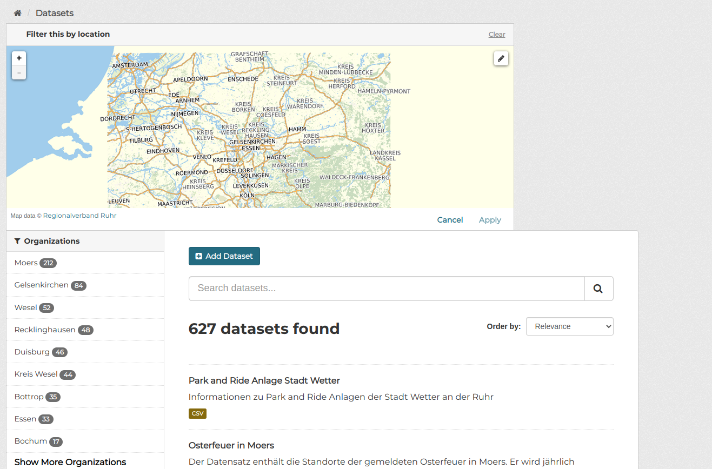
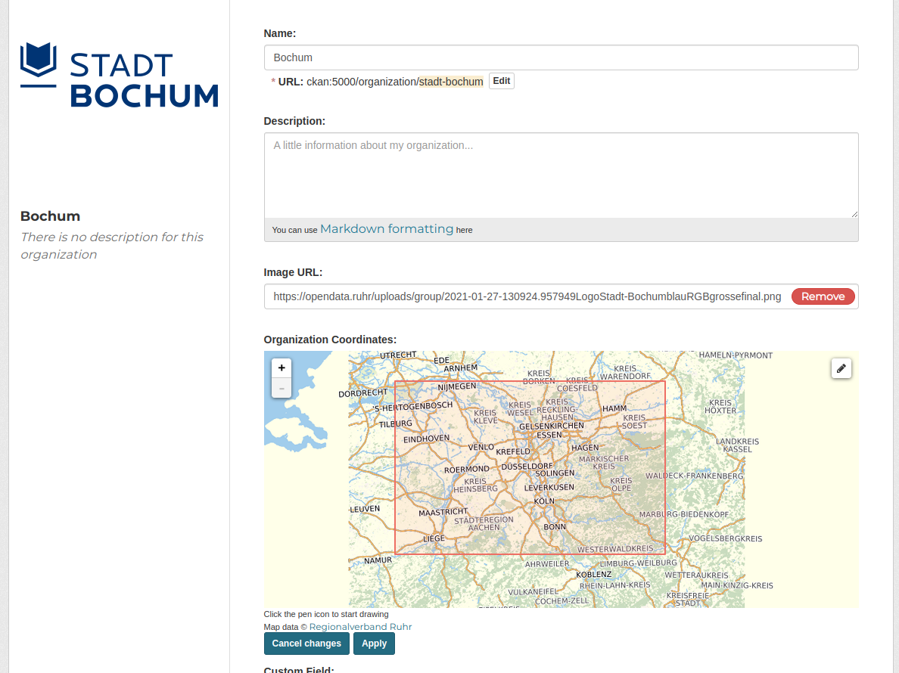
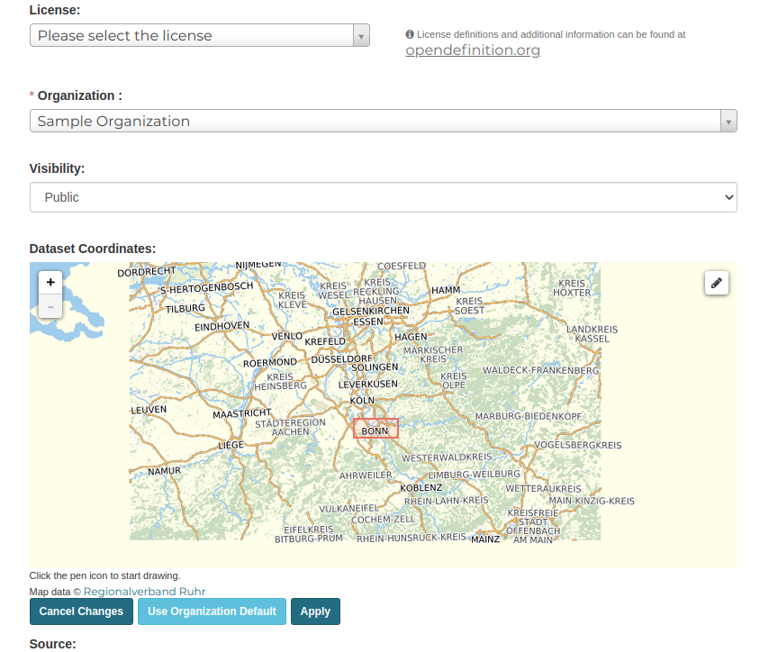
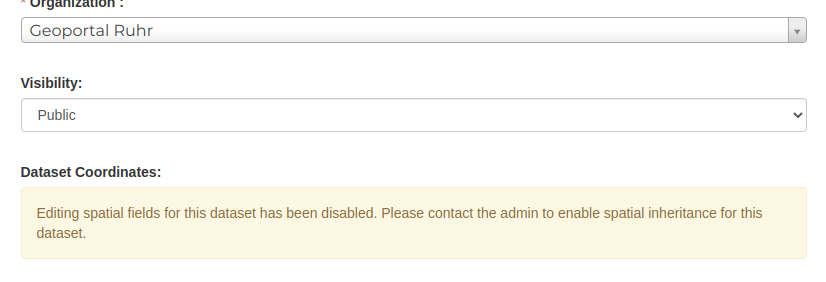

# Documentation of the ckanext-rvr plugins

## RVR

This is the base plugin for this extension.

## RVR SPATIAL QUERY

This extends the [ckanext-spatial](https://github.com/ckan/ckanext-spatial) extension with added functionality and custom maps for Metropole Ruhr.

It is recommended to enable this extension alogside the [`rvr`](#rvr) plugin.
To enable this plugin, add: `rvr_spatial_query` to the `ckan.plugins`.

### Features

This plugin builds on the existing features offered by [ckanext-spatial](https://github.com/ckan/ckanext-spatial), and offers these:

#### Dataset search page uses Metropole Ruhr Map

The map on the dataset search page `/dataset` of the portal has been updated to use the map offered by [Regionalverband Ruhr](https://www.geonetzwerk.ruhr/) instead of the default openstreet map from the ckanext-spatial extension.



The bounds of the map are also restricted to the boundaries offered by [Regionalverband Ruhr](https://www.geonetzwerk.ruhr/) and no longer the entire world. So users can no longer pan beyond the boundaries of the Ruhr map. These are the GeoJSON coordinates used for the max boundaries of the map:

```json
{
    "type": "Polygon",
    "coordinates": [
        [
            [
                4.2132568359375,
                49.8122251229721
            ],
            [
                10.1568603515625,
                52.58198281531925
            ],
            [
                4.2132568359375,
                52.58198281531925
            ],
            [
                10.1568603515625,
                49.8122251229721
            ],
            [
                4.2132568359375,
                49.8122251229721
            ]
        ]
    ]
}
```

#### Datasets and Organizations have interactive maps to define their spatial data

Spatial fields can now be added to datasets and organizations using an interactive map in their metadata edit pages.

**Organizations:**



**Datasets:**




#### Datasets now inherit spatial data from organizations

Datasets can also inherit spatial data from their organizations. If no spatial map is manually assigned to a dataset in their metadata page, they would automatically use the organization's spatial if it has one.

### Commands

#### `ckan rvr-spatial migrate` command

This command migrates spatial fields for datasets, to prepare them for the spatial inheritance feature of the ckanext-rvr extension.

It is defined in the [ckanext/rvr/commands/migrate_spatial_fields.py file](../ckanext/rvr/commands/migrate_spatial_fields.py)

This command gets datasets that have data in their `spatial` fields, but **NO** data in their `dataset_spatial` fields and the data in their `spatial` field **IS DIFFERENT** from that in the organization's `org_spatial` field, indicating that the dataset has not been prepared to use the spatial inheritance feature of the ckanext-rvr extension. For these datasets, the `spatial` data would be copied into the `dataset_spatial` field to prevent it from being overwritten by the organization spatial.

To use this command, run:
```sh
ckan rvr-spatial migrate
```
To view the datasets that would be migrated without running the actual command, add a `--dry-run` flag:
```sh
ckan rvr-spatial migrate --dry-run
```

> **Why is this command needed?**:
>
> For the [ckanext-spatial](https://github.com/ckan/ckanext-spatial) extension to run spatial queries against datasets, they are required to have the `spatial` field. This plugin allows setting the spatial fields from the organization and the datasets can inherit that if they don't have their own spatial defined.<br>
> To achieve that, a `dataset_spatial` field has been added for datasets and an `org_spatial` field has been added for organizations. The `spatial` field still tracks the dataset spatial data, but now if a spatial is assigned to the dataset, it is stored in the `dataset_spatial` field instead and then copied into the `spatial` field before indexing. If no spatial is assigned, the `spatial` field defaults to the organization spatial defined in the `org_spatial` field of the organization. <br>
> If this feature is just being implemented for the first time, some datasets might already have data in their `spatial` fields but their `dataset_spatial` fields would be empty, this would mean that the data would get overriden by the organization default and could be lost. To prevent that the command was created to automatically copy the spatial fields into the `dataset_spatial` fields.

If this warning is seen in a dataset metadata page instead of the dataset map:



> Editing spatial fields for this dataset has been disabled. Please contact the admin to enable spatial inheritance for this dataset.

The `ckan rvr-spatial migrate` command should be run to fix that. What is happening is that the spatial map is not being displayed to prevent the organization default from overriding the spatial before it saved in the `dataset_spatial` field of the dataset.

### Map Configurations

> The maps currently use [leaflet version 0.7.7](https://leafletjs.com/reference-0.7.7.html). In this extension, the [ckanext/rvr/assets/js/rvrMap.js file](../ckanext/rvr/assets/js/rvrMap.js) contains the code for instantiating the leaflet map. Changes made here affect all ckanext-rvr maps.
>
> The maps can be further configured with any of the configurations in the [leaflet.js documentation](https://leafletjs.com/reference-0.7.7.html)

* The configuration and code for the dataset and organization metadata maps are defined in the [ckanext/rvr/assets/js/rvrBBOXGenerator.js file](../ckanext/rvr/assets/js/rvrBBOXGenerator.js).
* The configuration and code for the dataset search map is defined in the [ckanext/rvr/assets/js/rvrSpatialQuery.js file](../ckanext/rvr/assets/js/rvrSpatialQuery.js)
